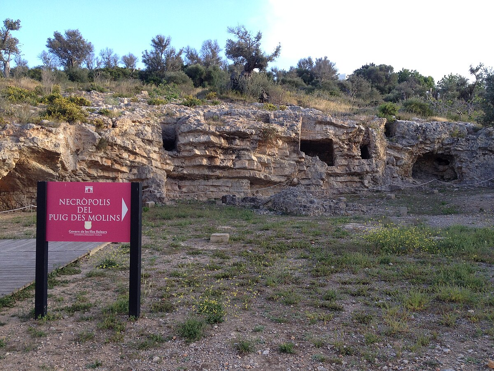

<style type="text/css">
h1.title {
  font-size: 36px;
  color: DarkRed;
  text-align: center;
}
</style>

## Puig des Molins

<hr>


[**Puig des Molins**](https://www.illesbalears.travel/en/ibiza/necropolis-puig-des-molins) is a small hill located on the south-west side of the bay of Ibiza.  This place was chosen by the founders of the city of Ibiza, the Phoenicians, in the 7th century BC, and along all the Antiquity, to bury their dead. Nearly 5 preserved hectares, it is the largest and most well-preserved Phoenician-Punic necropolis in the western Mediterranean basin. You can visit the site and the Monographic [**Museum Puig des Molins**](https://maef.eu/en/) (free entrance!) to enjoy thousands of extraordinary and beautiful objects discovered in the tombs.
In 1999, it was declared by UNESCO as a World Heritage Site, among other elements in Ibiza such as the 16th century walls of Dalt Vila and the Phoenician site of Sa Caleta.

```{r echo=FALSE}
objpath2 <- file.path(getwd(),"images/carousel_arch_museum")
slickR::slickR(
    list.files(objpath2,full.names = TRUE,pattern = 'jpeg'),
    height = 350,
    width = '95%')
```


<!--  -->
<!--  -->

