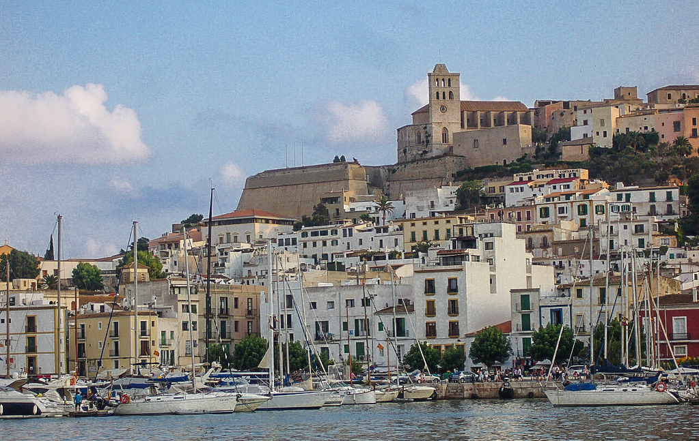
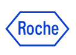
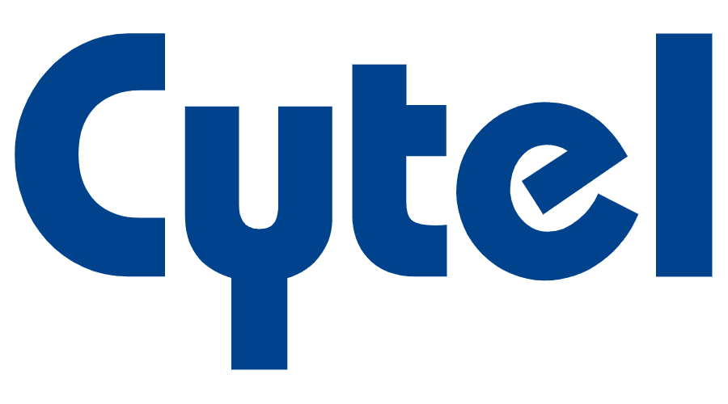
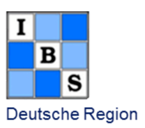
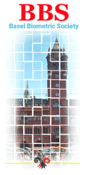

<style type="text/css">
h1.title {
  font-size: 36px;
  color: DarkRed;
  text-align: center;
}
</style>

```{r figurename, echo=FALSE, fig.cap="Eivissa Port", out.width = '60%', fig.align='center'}
# 
```

```{r echo=FALSE}
# https://stackoverflow.com/questions/61313078/create-a-carousel-in-rmarkdown
objpath <- file.path(getwd(),"slickr_files/figure-html")
slickR::slickR(
    list.files(objpath,full.names = TRUE,pattern = 'png'),
    height = 320,
    width = '95%')
```


<style type="text/css">
  body{
  font-size: 12pt;
}
</style> 

<br>

We are delighted to announce the next annual workshop of the joint working group “Adaptive Designs and Multiple Testing Procedures” of the German (DR) and the Austrian-Swiss (ROeS) Regions of the International Biometric Society (IBS). The workshop will be organized jointly with the Basel Biometric Society.

**Where:** XXX, Eivissa, Spain. The workshop will be a **face-to-face event**, with no option to participate virtually.

**When:** The workshop will run from 25th April, 2024 (opening at XXX) until 26th April, 2024 (closing at XXX).

**Invited Speakers:** We are delighted to announce that **Prof. XXX** (University of XXX) and **Dr. XXX** (XXX) will present as invited speakers. The workshop will also feature an invited session on platform trials, with contributions from the EU-PEARL IMI Project.


**Registration:** Registration closed on XXX, 2024.

**Abstract submission** Submission of abstracts closed on XXX, 2024.

**Local Organizing Committee:** XXX

**Contact:** If you have any questions about the workshop, please e-mail [Marta Bofill Roig](mailto:marta.bofillroig@meduniwien.ac.at).

$$\\[0.1cm]$$

**We are grateful to acknowledge sponsorship from**:

{width=15%}
&nbsp;&nbsp;
{width=25%}
&nbsp;&nbsp;
{width=13%}
&nbsp;&nbsp;
{width=15%}


$$\\[0.1cm]$$

**ORGANIZED BY**:

{width=13%}
{width=13%}



