<style type="text/css">
h1.title {
  display: none;
}
</style>

<style type="text/css">
.subtitle {
  font-size: 36px;
  color: DarkRed;
  text-align: center;
}
</style>

<style type="text/css">
  body{
  font-size: 12pt;
}
</style> 

<style>
.sponsor {
  display: inline-block;
  margin: 10px;
}

.sponsor img {
  max-width: 100%;
  height: auto;
}

.sponsor-level-gold {
  text-align: center;
  margin-bottom: 30px;
  background-color: #D4AF37
}
.sponsor-level-silver {
  text-align: center;
  margin-bottom: 30px;
  background-color: #A6A6A6
}
.organizers {
  text-align: center;
  margin-bottom: 30px;
  background-color: #ADD8E6 
}

</style>

```{=html}
<head>
<title>ADMTP2024</title>
</head>
```

```{r echo=FALSE}
# https://stackoverflow.com/questions/61313078/create-a-carousel-in-rmarkdown
objpath <- file.path(getwd(),"images/carousel_home")
slickR::slickR(
    list.files(objpath,full.names = TRUE,pattern = 'png'),
    height = 350,
    width = '95%')
```


<br><br>


<div style="background-color: #cfc ; padding: 10px; border: 1px solid green;">


<br>
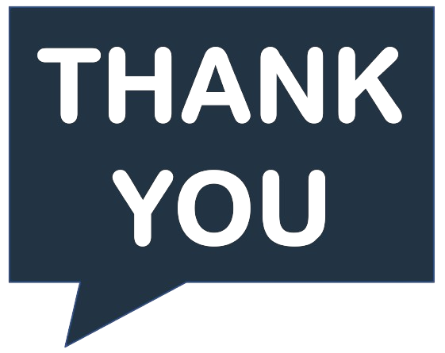{width=25px}
&nbsp; A heartfelt thank you to all the participants whose enthusiasm, expertise, and engagement made our conference ADMTP-2024 a resounding success!


<br>
{width=25px} 
&nbsp; Stay in the loop with the latest insights and updates from our conference following us on X/Twitter: [https://twitter.com/ADMTP_IBS](https://twitter.com/ADMTP_IBS). 

<br>
{width=25px}
&nbsp; Experience the highlights and memories captured at our conference through our exclusive [photo gallery](https://admtp.github.io/ADMTP2024/gallery.html) — immerse yourself in the moments that made our event unforgettable!  

</div>

<br>

We are delighted to announce the annual workshop of the joint working group “Adaptive Designs and Multiple Testing Procedures” of the German (DR) and the Austrian-Swiss (ROeS) Regions of the International Biometric Society (IBS). The workshop will be organized jointly with the Universitat de les Illes Balears.

**Where:** Ibiza, Spain. The workshop will be a face-to-face event, with no option to participate virtually.

**When:** The workshop will run from 25th April, 2024 (opening at 9 am) until 26th April, 2024 (closing at 6 pm).

**Invited Speakers**: We are delighted to announce that **Dr. Dominic Magirr** (Novartis Pharma AG) and **Dr. Annette Kopp-Schneider** (German Cancer Research Center) will present as invited speakers. The workshop will also feature two invited sessions on *Methodological and practical outcomes from the Adaptive Designs* and on *Practical experiences of using software to design clinical trials using simulations*


**Registration:** Registration closed on 15 March 2024. 
<!-- Please use the conftool for registration: [https://www.conftool.org/admtp-workshop-2024/](https://www.conftool.org/admtp-workshop-2024/) -->

**Abstract submission** Submission of abstracts closed on 12 February 2024.

**Scientific and Organizing Committee:** Marta Bofill Roig (Medical University of Vienna), 
 Thomas Asendorf (Medical University of Göttingen),
 Jordi Cortés Martínez (Universitat Politècnica de Catalunya), 
 Alexandra Graf  (Medical University of Vienna), 
 Sonja Zehetmayer  (Medical University of Vienna), 
 <!-- Juan Carbonell Asins (INCLIVA Instituto de Investigación Sanitaria), -->
 Francesc A. Rosselló Llompart (Universitat de les Illes Balears),
 Irene García Mosquera (Universitat de les Illes Balears) and
 Arnau Mir Torres (Universitat de les Illes Balears).

**Contact:** If you have any questions about the workshop, please e-mail [Marta Bofill Roig](mailto:marta.bofillroig@meduniwien.ac.at).

$$\\[0.1cm]$$


# Sponsors

<hr>

**We are grateful to acknowledge sponsorship from**:

<!-- ## <span style="color: #D4AF37;"><b>Gold Sponsors</b></span> -->

<!-- <hr> -->

```{=html}
<div class="sponsor-level-gold">
    <div class="sponsor">
        <a href="https://www.rpact.com/"; target=_blank">
        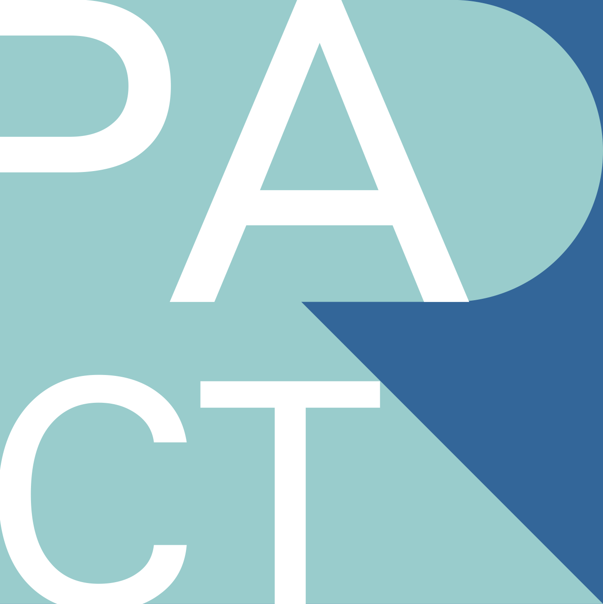
        </a>
    </div>
    <div class="sponsor">
        <a href="https://grbio.upc.edu/en"; target=_blank">
        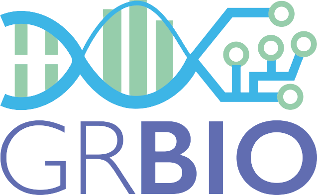
        </a>
    </div>
    <div class="sponsor">
        <a href="https://www.novartis.com/"; target=_blank">
        
        </a>
    </div>
</div>
```


<!-- ## <span style="color: #A6A6A6;"><b>Silver Sponsors</b></span> -->

<!-- <hr> -->

```{=html}
<!-- <div class="sponsor-level-silver"> -->
<!--     <div class="sponsor"> -->
<!--         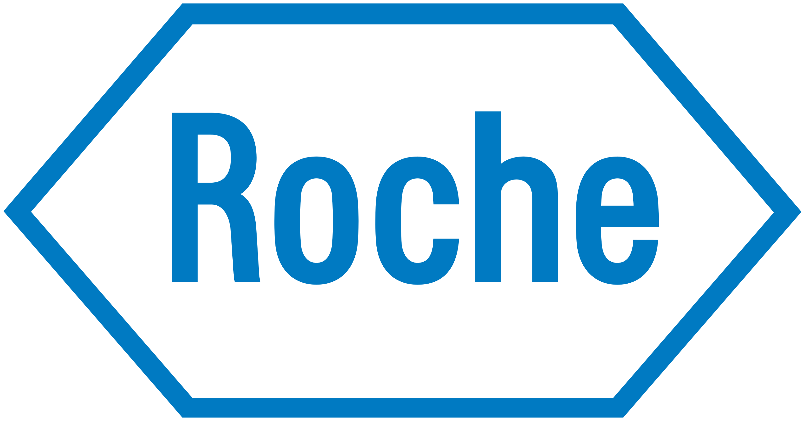 -->
<!--     </div> -->
<!--     <div class="sponsor"> -->
<!--         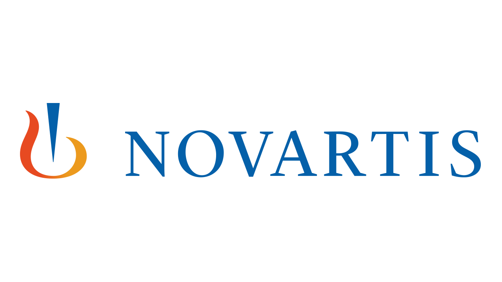 -->
<!--     </div> -->
<!--     <div class="sponsor"> -->
<!--         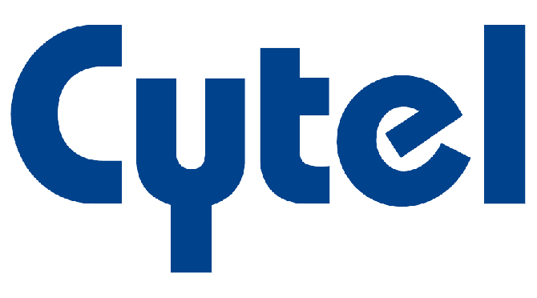 -->
<!--     </div> -->
<!--     <div class="sponsor"> -->
<!--          -->
<!--     </div> -->
<!-- </div> -->
```


<!-- {width=15%} -->
<!-- &nbsp;&nbsp; -->
<!-- 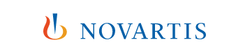{width=25%} -->
<!-- &nbsp;&nbsp; -->
<!-- 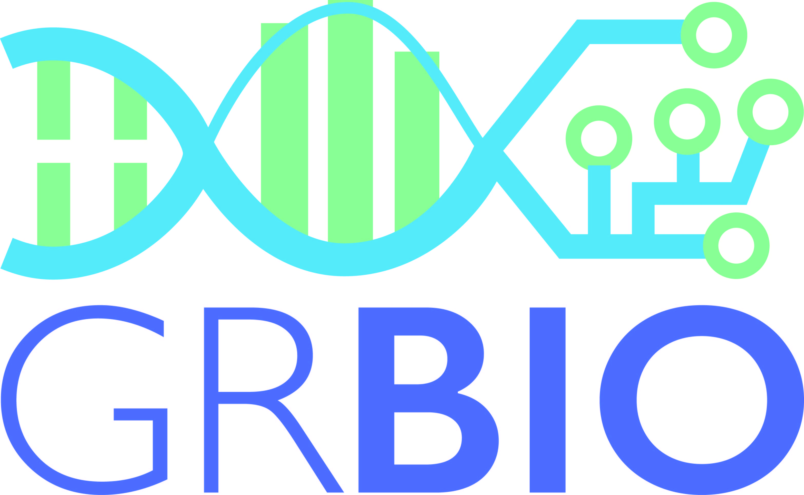{width=13%} -->
<!-- &nbsp;&nbsp; -->
<!-- {width=15%} -->


$$\\[0.1cm]$$

# Organizers

<hr>

**ORGANIZED BY**:


```{=html}
<div class="organizers">
    <div class="sponsor">
        <a href="https://www.ibs-roes.org/"; target=_blank">
        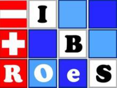
        </a>
    </div>
    <div class="sponsor">
        <a href="http://www.biometrische-gesellschaft.de/en/home.html"; target=_blank">
        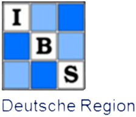
        </a>
    </div>
        <div class="sponsor">
        <a href="https://www.uib.eu/"; target=_blank">
        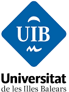
        </a>
    </div>
    <!-- <div class="sponsor"> -->
    <!--      -->
    <!-- </div> -->
</div>
```

<!-- {width=13%} -->
<!-- {width=13%} -->
<!--  -->


