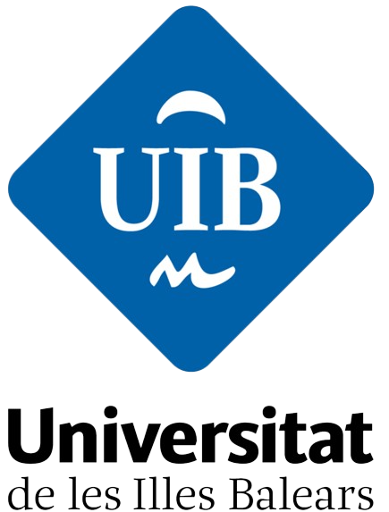

<style type="text/css">
h1.title {
  display: none;
}
</style>

<style type="text/css">
.subtitle {
  font-size: 36px;
  color: DarkRed;
  text-align: center;
}
</style>

<style type="text/css">
  body{
  font-size: 12pt;
}
</style> 

<style>
.sponsor {
  display: inline-block;
  margin: 10px;
}

.sponsor img {
  max-width: 100%;
  height: auto;
}

.sponsor-level-gold {
  text-align: center;
  margin-bottom: 30px;
  background-color: #D4AF37
}
.sponsor-level-silver {
  text-align: center;
  margin-bottom: 30px;
  background-color: #A6A6A6
}
.organizers {
  text-align: center;
  margin-bottom: 30px;
  background-color: #ADD8E6 
}

</style>

```{=html}
<head>
<title>ADMTP2024</title>
</head>
```

```{r figurename, echo=FALSE, fig.cap="Eivissa Port", out.width = '60%', fig.align='center'}
# knitr::include_graphics("Eivissa_1.jpg")
```

```{r echo=FALSE}
# https://stackoverflow.com/questions/61313078/create-a-carousel-in-rmarkdown
objpath <- file.path(getwd(),"images/carousel_home")
slickR::slickR(
    list.files(objpath,full.names = TRUE,pattern = 'png'),
    height = 350,
    width = '95%')
```


<br><br>


<div style="background-color: #cfc ; padding: 10px; border: 1px solid green;">

<br>
{width=25px} 
&nbsp; <b><font color="#ff0000">The deadline for registration</font></b> has been extended to <b>15 March</b>. 

<br>
{width=25px} 
&nbsp; To avoid paying a higher price for your accommodation, we highly recommend booking your stay <b>as soon as possible</b>. 

<br>
{width=25px}
&nbsp; You can still book your room at the <a href="https://admtp.github.io/ADMTP2024/venue.html"><b>venue hotel</b></a>, and 
note that you will receive a <b>discount</b> when you register.  

<br>
{width=25px}
&nbsp; Moreover, there are <b>direct flights</b> available from various central cities such as Vienna, Basel, 
Berlin, Frankfurt, and London to Ibiza on the dates of the event.
</div>

<br>

We are delighted to announce the next annual workshop of the joint working group “Adaptive Designs and Multiple Testing Procedures” of the German (DR) and the Austrian-Swiss (ROeS) Regions of the International Biometric Society (IBS). The workshop will be organized jointly with the Universitat de les Illes Balears.

**Where:** Ibiza, Spain. The workshop will be a face-to-face event, with no option to participate virtually.

**When:** The workshop will run from 25th April, 2024 (opening at 9 am) until 26th April, 2024 (closing at 6 pm).

<!-- **Invited Speakers:** We are delighted to announce that **Prof. XXX** (University of XXX) and **Dr. XXX** (XXX) will present as invited speakers. The workshop will also feature an invited session on platform trials, with contributions from the EU-PEARL IMI Project. -->


**Registration:** Registration closes on 15 March 2024. Please use the conftool for registration: [https://www.conftool.org/admtp-workshop-2024/](https://www.conftool.org/admtp-workshop-2024/)

**Abstract submission** Submission of abstracts closes on 12 February 2024.

**Scientific and Organizing Committee:** Marta Bofill Roig (Medical University of Vienna), 
 Thomas Asendorf (Medical University of Göttingen),
 Jordi Cortés Martínez (Universitat Politècnica de Catalunya), 
 Alexandra Graf  (Medical University of Vienna), 
 Sonja Zehetmayer  (Medical University of Vienna), 
 <!-- Juan Carbonell Asins (INCLIVA Instituto de Investigación Sanitaria), -->
 Francesc A. Rosselló Llompart (Universitat de les Illes Balears),
 Irene García Mosquera (Universitat de les Illes Balears) and
 Arnau Mir Torres (Universitat de les Illes Balears).

**Contact:** If you have any questions about the workshop, please e-mail [Marta Bofill Roig](mailto:marta.bofillroig@meduniwien.ac.at).

$$\\[0.1cm]$$


# Sponsors

<hr>

**We are grateful to acknowledge sponsorship from**:

<!-- ## <span style="color: #D4AF37;"><b>Gold Sponsors</b></span> -->

<!-- <hr> -->

```{=html}
<div class="sponsor-level-gold">
    <div class="sponsor">
        <a href="https://www.rpact.com/"; target=_blank">
        
        </a>
    </div>
    <div class="sponsor">
        <a href="https://grbio.upc.edu/en"; target=_blank">
        
        </a>
    </div>
</div>
```


<!-- ## <span style="color: #A6A6A6;"><b>Silver Sponsors</b></span> -->

<!-- <hr> -->

```{=html}
<!-- <div class="sponsor-level-silver"> -->
<!--     <div class="sponsor"> -->
<!--          -->
<!--     </div> -->
<!--     <div class="sponsor"> -->
<!--          -->
<!--     </div> -->
<!--     <div class="sponsor"> -->
<!--          -->
<!--     </div> -->
<!--     <div class="sponsor"> -->
<!--          -->
<!--     </div> -->
<!-- </div> -->
```


<!-- {width=15%} -->
<!-- &nbsp;&nbsp; -->
<!-- {width=25%} -->
<!-- &nbsp;&nbsp; -->
<!-- {width=13%} -->
<!-- &nbsp;&nbsp; -->
<!-- {width=15%} -->


$$\\[0.1cm]$$

# Organizers

<hr>

**ORGANIZED BY**:


```{=html}
<div class="organizers">
    <div class="sponsor">
        <a href="https://www.ibs-roes.org/"; target=_blank">
        
        </a>
    </div>
    <div class="sponsor">
        <a href="http://www.biometrische-gesellschaft.de/en/home.html"; target=_blank">
        
        </a>
    </div>
        <div class="sponsor">
        <a href="https://www.uib.eu/"; target=_blank">
        
        </a>
    </div>
    <!-- <div class="sponsor"> -->
    <!--      -->
    <!-- </div> -->
</div>
```

<!-- {width=13%} -->
<!-- {width=13%} -->
<!--  -->


