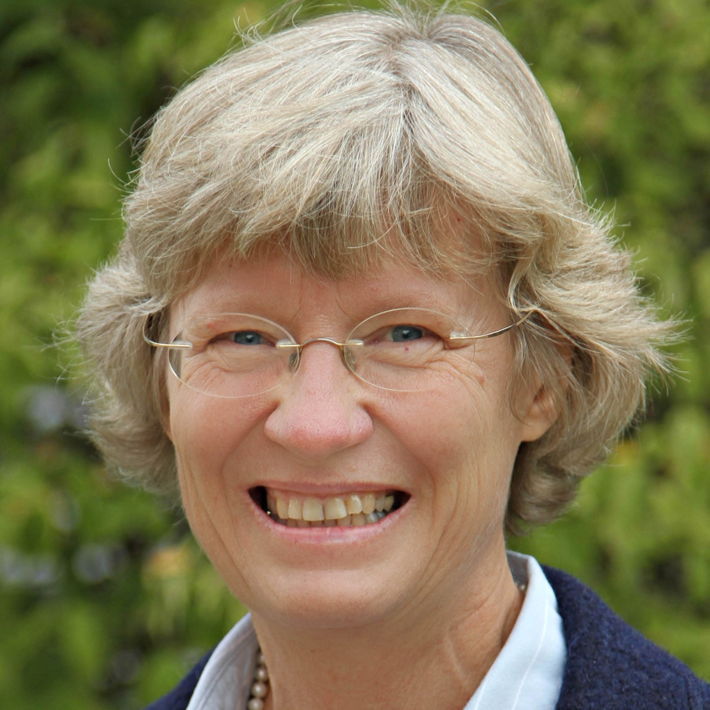

<!-- # Adaptive Designs and Multiple Testing Procedures Workshop -->

<!-- ## Invited Speakers -->

  

### Keynote speaker: **Dominic Magirr (Novartis Pharma AG)**

{width=25%}

<!-- Dr. **Emily Johnson** is a renowned statistician and expert in adaptive designs for clinical trials. She received her Ph.D. in Biostatistics from XYZ University and has over 15 years of experience in the field. Dr. Johnson has published numerous articles on adaptive trial designs and has been invited to speak at various international conferences. Her research focuses on developing innovative statistical methods for improving the efficiency and ethical aspects of clinical trials. -->

 

<h3>**Deconstructing the Max-combo Test**</h3>

The Max-Combo Test (Lin et al., 2020) is an adaptive procedure to select the best test statistic from a small prespecified set of candidates. It includes a correction for multiplicity. Proposed applications include clinical trials in oncology when there is prior uncertainty regarding the commonly made proportional hazards assumption. In this context, the candidate set of test statistics usually come from the Fleming-Harrington rho-gamma family of weighted log-rank statistics. In some of the candidate test statistics, the weighting is tilted towards events occurring in the early part of follow up, whereas in others it is tilted towards events in the later part of follow up. The overall procedure is therefore robust to a wide range of treatment effect patterns. 

In this talk I shall take a close look at the Max-Combo Test, using recently proposed visualization techniques (Jimenez et al., 2023) to explain some of its counter-intuitive properties, as pointed out in recent publications (Freidlin & Korn, 2019). The same visualization techniques can be used to re-evaluate weighted log-rank tests in the broader context of the estimand framework in clinical trials. 

References

- Lin, R.S., Lin, J., Roychoudhury, S., Anderson, K.M., Hu, T., Huang, B., Leon, L.F., Liao, J.J., Liu, R., Luo, X. and Mukhopadhyay, P., 2020. Alternative analysis methods for time to event endpoints under nonproportional hazards: a comparative analysis. Statistics in Biopharmaceutical Research, 12(2), pp.187-198

- Fleming, T.R. and Harrington, D.P., 1981. A class of hypothesis tests for one and two sample censored survival data. Communications in Statistics-Theory and Methods, 10(8), pp.763-794.

- Jiménez, J.L., Barrott, I., Gasperoni, F. and Magirr, D., 2023. Visualizing hypothesis tests in survival analysis under anticipated delayed effects. arXiv preprint arXiv:2304.08087.

- Freidlin, B. and Korn, E.L., 2019. Methods for accommodating nonproportional hazards in clinical trials: ready for the primary analysis?. Journal of Clinical Oncology, 37(35), p.3455.

&nbsp;

### Keynote speaker: **Annette Kopp-Schneider (German Cancer Research Center)**

{width=25%}

**Title and abstract to be announced**

&nbsp;

### Invited Sessions

<h3>**Methodological and practical outcomes from the Adaptive Designs Working Group of the MRC-NIHR Trials Methodology Research Partnership**</h3>

 

<!-- Speakers: -->

<!-- <table cellspacing="0" cellpadding="0" table-layout="fixed" width="100%" word-wrap="break-word"> -->
<!-- <thead> -->
<!--   <tr> -->
<!--     <td align="center" width="200"><b>TBA</b></td> -->
<!--     <td align="center" width="200"><b>Estimation after adaptive designs</b></td> -->
<!--     <td align="center" width="200"><b>Making adaptive designs more accessible. A practical adaptive designs toolkit</b></td> -->
<!--   </tr> -->
<!-- </thead> -->
<!-- <tbody> -->
<!--   <tr> -->
<!--     <th></th> -->
<!--     <th></th> -->
<!--     <th></th> -->
<!--   </tr>   -->
<!--   <tr> -->
<!--     <td align="center"><b>Faye Williamson</b></td> -->
<!--     <td align="center"><b>David Robertson</b></td> -->
<!--     <td align="center"><b>Munya Dimairo</b></td> -->
<!--   </tr> -->
<!--   <tr> -->
<!--     <td align="center">Newcastle University</td> -->
<!--     <td align="center">University of Cambridge</td> -->
<!--     <td align="center">University of Sheffield</td> -->
<!--   </tr> -->

<!-- </tbody> -->
<!-- </table> -->

<table cellspacing="0" cellpadding="0" table-layout="fixed" width="100%" word-wrap="break-word">
<tbody>
  
  <tr>
    <td align="center" width="275"></td>
    <td><i><h4> Exploring current practices in adaptive trials: patient information sheets, costing, and efficiently conducting interim analyses</h4></i> <b>Faye Williamson</b> (Newcastle University)</td>
  </tr>
  
  <tr>
    <td align="center"></td>
    <td><i><h4>Estimation after adaptive designs</h4></i> <b>David Robertson</b> (University of Cambridge)</td>
  </tr>  
  
  <tr>
    <td align="center"></td>
    <td><i><h4>Making adaptive designs more accessible. A practical adaptive designs toolkit</h4></i>  <b>Munya Dimairo</b> (University of Sheffield)</td>
  </tr>

</tbody>
</table>

<!-- - Faye Williamson (Newcastle University) -->
<!-- - David Robertson (MRC Biostatistics Unit, University of Cambridge) -->
<!-- - Munya Dimairo (University of Sheffield) -->

   

<h3>**Practical experiences of using software to design clinical trials using simulations**</h3>

<!-- Speakers: -->
 

<!-- cellspacing="0" cellpadding="0" table-layout="fixed" width="100%" word-wrap="break-word" -->

<table cellspacing="0" cellpadding="0" table-layout="fixed" width="100%" word-wrap="break-word">
<tbody>
  
  <tr>
    <td align="center" width="275"></td>
    <td><h4><i>Using the "SIMulating PLatform trials Efficiently" (SIMPLE) R package to develop a simulator for a bespoke platform trial</h4></i>  <b>Peter Jacko</b> (Berry Consultants)</td>
  </tr>
  
  <tr>
    <td align="center"></td>
    <td><i><h4>Flexible Clinical Trial Planning with the R Package rpact</h4></i>  <b>Gernot Wassmer \& Friedrich Pahlke</b> (RPACT)</td>
  </tr>  
  
  <!-- <tr> -->
  <!--   <td align="center"></td> -->
  <!--   <td><i><h4>Flexible Clinical Trial Planning with the R Package rpact</h4></i>  <b>Friedrich Pahlke</b> (RPACT)</td> -->
  <!-- </tr> -->
  
  <tr>
    <td align="center"></td>
    <td><i><h4>Design or simulation: What comes first?</h4></i>  <b>Tobias Mielke</b> (Janssen)</td>
  </tr>
  
  <tr>
    <td align="center"></td>
    <td><i><h4>Discussant</h4></i>  <b>Daniel Sabanés Bové</b> (Roche)</td>
  </tr>

</tbody>
</table>

<!-- - Peter Jacko (Berry Consultants) -->
<!-- - Gernot Wassmer (RPACT) -->
<!-- - Friedrich Pahlke (RPACT) -->
<!-- - Tobias Mielke (Janssen) -->
<!-- - Daniel Sabanés Bové (Roche) -->